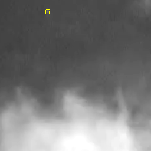
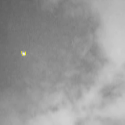

# 基于图像分割的红外弱小目标检测算法
# Infrared Target Detection by Segmentation (Deeplearing Method)
## support **Unet** and **FCN** 



## 新增在线预测Demo
[Demo](https://share.streamlit.io/linaom1214/infrared-detect-by-segmentation/display.py)

## [Usage](#Infrared-Target-Detection-by-Segmentation)

### Training
```python
python main.py train
```
### Test
```python
python main.py test image_dir
```
### Evaluation
```python
python main.py evaluate
```
### Visual DataSet 
```python
python main.py vis_dl
```

## [Datasets](#Infrared-Target-Detection-by-Segmentation)
- SIRST dataset is available at [SIRST](https://github.com/YimianDai/sirst).

## More Configs in main.py

## TODO
- [ ] onnx export 
- [ ] TensorRT Deploy

## Model Weights

FCN  [weights](https://github.com/Linaom1214/Infrared-detect-by-segmentation/releases/download/v0.1/fcn_best.pt)

Unet [weights](https://github.com/Linaom1214/Infrared-detect-by-segmentation/releases/download/v0.1/unet_best.pt)

