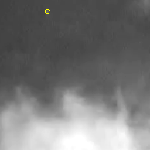
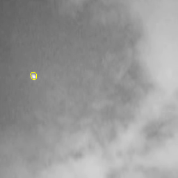

# 基于图像分割的红外弱小目标检测算法
# Infrared Target Detection by Segmentation (Deeplearing Method)
## support **Unet** and **FCN** 



## [Usage]

### Training
```python
python main.py train
```
### Test
```python
python main.py test image_dir
```
### Evaluation
```python
python main.py evaluate
```
### Visual DataSet 
```python
python main.py vis_dl
```

## [Datasets]
- SIRST dataset is available at [SIRST](https://github.com/YimianDai/sirst).

## More Configs in main.py

## Model Weights